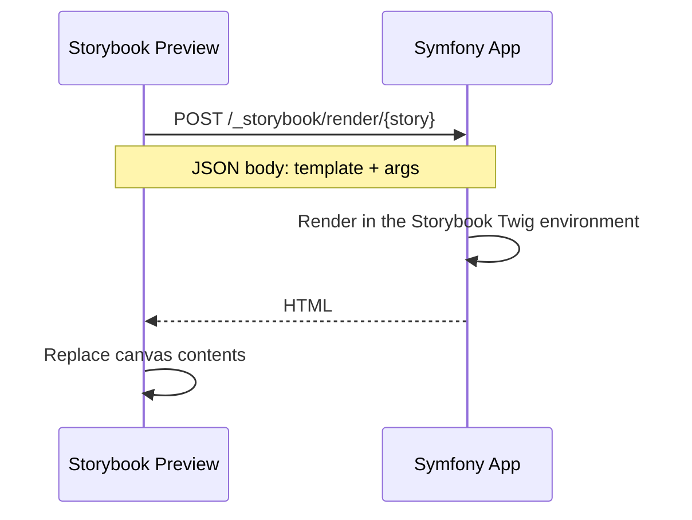

# Architecture

This repository contains one Composer package and three JavaScript workspace packages. They are versioned together because the Symfony bundle and the Storybook framework packages are tightly coupled.

## Runtime Model

Storybook does not render Twig in the browser. Stories compile to a Twig template string and an args object. The preview sends both to Symfony, Symfony renders the template through the bundle, and the rendered HTML is inserted back into the Storybook canvas.



The Storybook builder still matters. It runs the Storybook UI, compiles story modules, injects preview HTML, watches files, proxies Symfony requests in development, and provides the browser test environment.

## Packages

| Path               | Package                                 | Audience      | Responsibility                                                                                                                  |
| ------------------ | --------------------------------------- | ------------- | ------------------------------------------------------------------------------------------------------------------------------- |
| `src/`             | `sensiolabs/storybook-bundle`           | Symfony users | Bundle services, render endpoint, Twig sandbox, component mocks, args processors, and `storybook:init`                          |
| `packages/shared`  | `@sensiolabs/storybook-symfony-shared`  | Internal only | Shared client renderer, Twig story helpers, Storybook docs/source helpers, Symfony command helpers, and common server utilities |
| `packages/vite`    | `@sensiolabs/storybook-symfony-vite`    | Consumers     | Storybook framework package for Vite, generated by default                                                                      |
| `packages/webpack` | `@sensiolabs/storybook-symfony-webpack` | Consumers     | Storybook framework package for Webpack 5 projects                                                                              |
| `sandbox/`         | local test app                          | Contributors  | Symfony application used for manual development and Storybook/Vitest integration checks                                         |

The published Vite and Webpack packages bundle the shared runtime into their `dist/` output. Consumers do not install `@sensiolabs/storybook-symfony-shared` directly.

## Consumer Configuration

`bin/console storybook:init` writes a `.storybook/main.ts` file. The important fields are:

```ts
import type { StorybookConfig } from "@sensiolabs/storybook-symfony-vite";

const config: StorybookConfig = {
  stories: ["../templates/components/**/*.stories.[tj]s"],
  addons: ["@storybook/addon-docs", "@storybook/addon-vitest"],
  framework: {
    name: "@sensiolabs/storybook-symfony-vite",
    options: {
      symfony: {
        server: "http://localhost:8000",
        proxyPaths: ["/assets", "/_components"],
        additionalWatchPaths: ["assets"],
      },
    },
  },
};

export default config;
```

For Webpack, import the same type from the Webpack package and change `framework.name`:

```ts
import type { StorybookConfig } from "@sensiolabs/storybook-symfony-webpack";

const config: StorybookConfig = {
  framework: {
    name: "@sensiolabs/storybook-symfony-webpack",
    options: {
      symfony: {
        server: "http://localhost:8000",
      },
    },
  },
};

export default config;
```

The `symfony.server` option is required for development because Storybook must call the Symfony app. Production builds can omit it when the generated static Storybook will be deployed behind a reverse proxy to Symfony.

## Builder Choice

Use Vite for new projects unless you have a Webpack-specific reason not to. Vite is the default because it is Storybook 10's modern path and works with `@storybook/addon-vitest`.

Use Webpack when an existing Storybook setup depends on Webpack loaders, plugins, aliases, or other Webpack-only behavior. The Webpack package targets Storybook's Webpack 5 builder.

## Contributor Flow

Install root dependencies:

```shell
composer install
npm install
```

The JavaScript workspace also supports pnpm, Yarn, and Bun:

```shell
pnpm install
yarn install
bun install
```

Build all JavaScript packages:

```shell
npm run build
```

The equivalent package-manager commands are `pnpm build`, `yarn build`, and `bun run build`.

The root script runs the same package script in `packages/shared`, `packages/vite`, and `packages/webpack`. The generated `dist/` files are committed because the Composer package is used from path dependencies during local and sandbox development.

Run the main checks:

```shell
composer validate --strict
vendor/bin/php-cs-fixer fix --dry-run --diff
vendor/bin/phpstan analyse --memory-limit=1G
vendor/bin/simple-phpunit
npm run build
npm run test
npm run lint
npm run format:check
```

Run the sandbox smoke checks:

```shell
./sandbox/bin/setup-standalone
./scripts/test-sandbox.sh
```

`setup-dev` is for interactive local work and symlinks the bundle into the sandbox. `setup-standalone` is for CI-like verification and copies the bundle into `sandbox/.bundle` before installing the sandbox.
